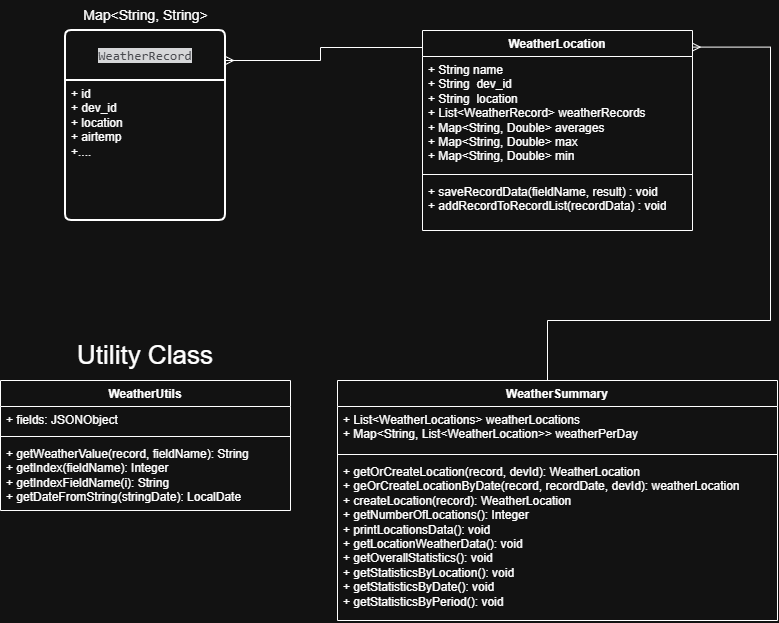

# Weather-Stations-Analysis
This script reads, parses and processes a record file containing weather measurements.

For every record we read its location based on the field "dev_id" (we could also do it by its GPS coords or name), then, in the class `WeatherSummary` we save it to a list of locations so we can separate and get the statistics for every location, the same is done for the per day statistics.

We present a menu option to show the statistical data allowing the user to select the data they want to see until they press 'q' to exit the menu and finish the program

We return the following statistical data about it:
* Every average, min and max values for each location in a specific date
* Average, min and max values for each location
* Overall average, min and max values
* Statistics by date range period

# Dependencies
* **json-simple v1.1.1:** This package was added to the project to parse and extract the weather data inside the json file, we don't need a complex data mapping, so this package will do fine

# Classes created
## WeatherUtils
`WeatherUtils` is a utility class that is not instanciated because we use the `final` keyword. 

Here we will save the `fields` list and the `Map` for fields display name. we also have functions like `getWeatherValue` where we search for the field name passed in the record array.

> **Note:** We chose the `fields` variable to be assignable so we can fetch the json and "similar" ones regardless of the order of the fields or if there is one or several missing fields from the records :fire:

## WeatherLocation
In this class we will search the records based on its location (dev_id). 

For each location we save its name, dev_id, GPS coords, list of weather measurements (records) and the average, max and min for each measurement (airtemp, etc...).

This class will be useful for the summary class where we make the operations to get statistics

## WeatherSummary
In this class we save the list of weather locations and the list of weather locations measurements per day.

Here we also get or create the locations based on the information of the weather record we are reading. 
There is also functions like `getOverallStatistics`, `getStatisticsByLocation` and `getStatisticsByDate` where we return the statistics based on the json read.

The following class diagram contains a visual explanation of the classes created to save and proccess the weather measurements

# Expected output 
---

jueves, 11 de noviembre del 2021: 

Data from Brougham Street, Geelong at location (-38.1456638, 144.3587789) 

* Atmospheric pressure: AVG=100.22  MIN=99.79  MAX=100.83 
* Gust speed: AVG=8.23  MIN=4.09  MAX=11.57 
* Precipitation: AVG=0.01  MIN=0.0  MAX=0.19 
* Relative humidity: AVG=77.28  MIN=62.0  MAX=93.0 
* Vapour pressure: AVG=1.16  MIN=1.01  MAX=1.29 
* Strikes: AVG=0.00  MIN=0.0  MAX=0.0 
* Air temperature: AVG=13.14  MIN=11.4  MAX=14.6 
* Solar: AVG=201.24  MIN=0.0  MAX=984.0 
* Windspeed: AVG=4.11  MIN=1.7  MAX=5.73 
* Strike distance: AVG=0.00  MIN=0.0  MAX=0.0 
* Wind direction: AVG=139.80  MIN=97.3  MAX=156.1 

---
